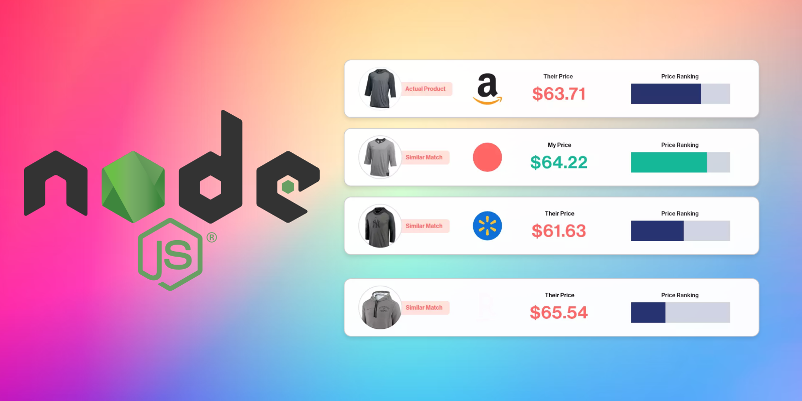

# Price Comparison Server

This is a simple Express server that can compare product names across multiple stores and return the matching products along with their prices. It uses the `string-similarity` library to find similar product names, even if they're spelled differently or in a different order.

## Installation

To get started, you'll need to have Node.js and npm installed on your machine. You can download them from the official website: https://nodejs.org/

Once you have Node.js and npm installed, follow these steps:

1. Clone the repository:

```bash
git clone https://github.com/your-username/price-comparison-server.git
```

2. Navigate to the project directory:

```bash
cd price-comparison-server
```

3. Install the dependencies:

```bash
npm install
```

This will install all the required packages specified in the `package.json` file.

## Usage

To start the server, run the following command:

```bash
npm run start
```

This will start the server on `http://localhost:3000`.

To compare prices, make a GET request to the `/compare-prices` endpoint with the `query` parameter set to the product name you want to search for. For example:

```
http://localhost:3000/compare-prices?query=milk
```

This will return an array of matching products from all the stores, along with their names and prices.

You can adjust the similarity threshold by modifying the `threshold` variable in the `app.js` file. A higher threshold will return fewer matches, while a lower threshold will return more matches.

## Code Overview

The main logic of the server is contained in the `app.js` file. Here's a brief overview of the code:

- The server is created using the `express` framework.
- Sample product data from three different stores is defined.
- Helper functions `normalizeString` and `compareTwoStrings` are used to preprocess and compare strings.
- The `/compare-prices` route handles GET requests and returns matching products based on the search query.
- The `string-similarity` library is used to compare product names and find similar matches.

Feel free to modify the code and add more functionality as needed.

## Contributing

If you find any issues or have suggestions for improvements, please feel free to open an issue or submit a pull request.

## License

This project is licensed under the [MIT License](LICENSE).

Have fun exploring and happy coding! 🚀
